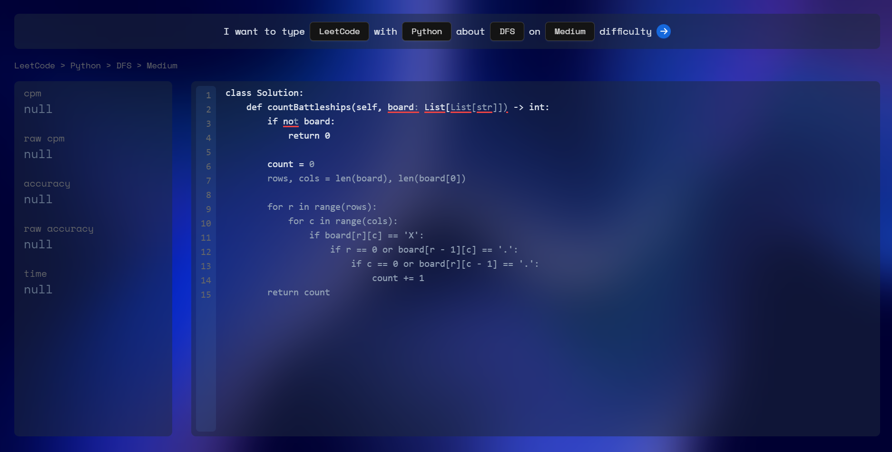

# SnippetSprint ⚡️

> **_Where code meets your fingertips._**
> Race against the clock (and soon, against others!) to type out code snippets as fast as you can.

## Table of Contents
- [Overview](#overview)
- [How It Works](#how-it-works)
- [Installation](#installation)
- [Usage](#usage)
- [Future Roadmap](#future-roadmap)
- [Contributing](#contributing)
- [License](#license)

## Overview
**SnippetSprint** is a code snippet typing racer, designed to hone your development speed and accuracy. Inspired by popular type racer sites like MonkeyType, it focuses specifically on **typing code** across various **programming languages** and **frameworks**.

Built with:

- [Vite](https://vitejs.dev)
- [ReactJS](https://reactjs.org)
- [TypeScript](https://www.typescriptlang.org)
- [Vitest](https://vitest.dev)
- [Testing Library](https://testing-library.com)
- [Tailwindcss](https://tailwindcss.com)
- [Eslint](https://eslint.org)
- [Prettier](https://prettier.io)
- [OpenAI's ChatGPT](https://chatgpt.com/)

**Why "SnippetSprint"?**
- Turbo-charge your typing speed for real-world coding scenarios
- Practice with diverse code bases (React, SwiftUI, Angular, etc.)
- Generate code challenges from **LeetCode** categories and difficulties on the fly

## How It Works
1. **Select a mode**
   - **LeetCode**: Pick a programming language (like JavaScript, Python, etc.), choose a challenge category (DFS, Arrays, etc.), and select your difficulty (Easy, Medium, Hard).
   - **Framework Snippets**: Choose from popular frameworks like React, SwiftUI, Angular, etc.
2. **Generate a snippet**
   Your selection is sent as a prompt to **OpenAI's API**, retrieving a unique code snippet from ChatGPT.
3. **Type away**
   Practice your typing speed and accuracy by racing against the clock to complete the snippet.
4. **Track your performance**
   Check your typing statistics such as characters per minute (CPM) or words per minute (WPM), and review your accuracy rating.

## Installation
1. Clone this repository:
   Use `git clone https://github.com/YourUsername/SnippetSprint.git` and then `cd SnippetSprint`.
2. Install dependencies:
   Run `pnpm install`.
3. Run the development server:
   Use `pnpm dev`.
4. Open the app in your browser at [http://localhost:5173/](http://localhost:5173/).

## Usage
- **Set up your OpenAI API credentials**: Have an API key from OpenAI and manage it in your environment variables or a similar secure location.
- **Choose a snippet category**:
  - LeetCode mode: language, category, difficulty.
  - Framework mode: React, SwiftUI, Angular, etc.
- **Start typing**: A code snippet will appear. Race against the clock and track your speed and accuracy at the end.

## Future Roadmap
1. Syntax Highlighting
2. Support for Longer Code Snippets
3. More Languages & Frameworks
4. Saving Scores to Personal Accounts
5. Character per Minute (CPM) Graph & Consistency Metrics
6. Live Leaderboard against Other Users

## Contributing
Contributions and suggestions are welcome! Whether it’s bug reports, feature ideas, or pull requests, please open an issue or pull request to discuss any changes.

1. Fork the repository
2. Create a new branch (e.g., `feature/my-idea`)
3. Commit your changes
4. Open a pull request
